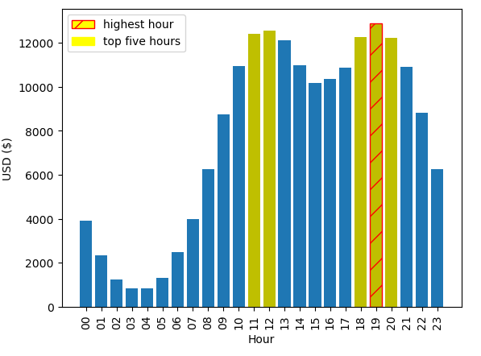

# sales-analysis-pandas

## Sales analysis of electronic devices database from Kaggle: /kaggle/input/sales-dataset-of-ecommerce-electronic-products

 * Python ( Pandas, Matplitlib)
 * Data Cleaning, Data Analysis, Data Visualization

## Question 1: What was the best month for sales? How much was earned that month?

The best month is December with $4608295.7

## Question 2. What city had the highest number of sales?

The City with the greatest number of sales is San Francisco (CA) with $8254743.55

## Question 3: What time should we display advertisements to maximize likelihood of curstomer's buying product?

Best hours: 11:00-12:00 and 18:00-20:00.

## Question 4. What products are most often sold together?

## Question 5. What product sold the most? Why do you think it sold the most?

The best-selling products, such as batteries, charging cables, and headphones, are also the cheapest.
